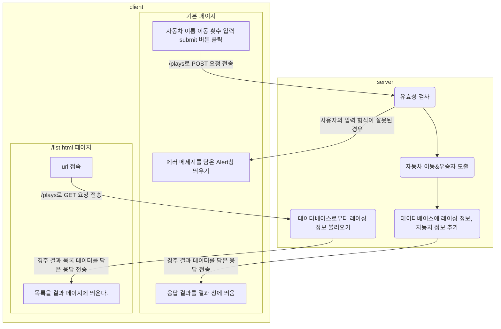

# 우테코 5기 2레벨 1~2주차 - 웹 자동차 경주 미션


> 우아한테크코스 5기 2레벨 1~2주차 미션, 웹 자동차 경주 미션을 구현한 저장소입니다.


# 목차
- [시작하기](#시작하기)
- [도메인 모델 네이밍 사전](#도메인-모델-네이밍-사전)
- [프로그램 흐름도](#프로그램-흐름도)
- [DB(DAO)](#dbdao)
- [기능 목록](#기능-목록)
  - [웹 요청/응답 구현하기](#웹-요청응답-구현하기)
  - [출력 방식 수정](#출력-방식-수정)
  - [리팩토링](#리팩토링)
  - [DB](#db)


## 시작하기
해당 레포지토리를 Clone하고 IDE에서 src/main/java/racing에 위치한 RacingCarApplication.java 파일을 실행시켜 프로그램을 동작시킬 수 있습니다.
```
git clone -b as https://github.com/amaran-th/jwp-racingcar.git
```
## 도메인 모델 네이밍 사전
| 한글명    | 영문명             | 설명                                               | 분류        |
|--------|-----------------|--------------------------------------------------|-----------|
| 자동차    | Car             | 이동과 이동 정보 상태를 가진 자동차 객체                          | class     |
| 자동차 이름 | CarName         | 자동차 이름 값을 의미하는 VO 객체                             | class     |
| 이동 정도  | Position        | 전진 정도를 의미하는 VO 객체                                | class     |
| 자동차들   | Cars            | 자료구조로 자동차 객체목록을 관리하고, 자동차들을 움직이고 점수를 계산하는 일급 컬렉션 | class     |
| 시도 횟수  | Trial           | 모든 자동차에 대한 이동 지시 횟수를 의미하는 VO 객체                  | class     |
| 결과     | Result          | 자동차와 그에 대응하는 이동 횟수 정보를 가진 DTO 객체                 | class     |
| 숫자 생성기 | NumberGenerator | Integer 하나를 만들어내는 인터페이스                          | interface |

## 프로그램 흐름도

## DB(DAO)

- H2 데이터베이스를 사용하였다.
- DB 테이블 설계
    - Database 명 : `racing_car`
        - Table 명 : `racing`

          | id | 플레이한 날짜/시간(created_at) |
          |-------|-----------------------|
          | 1 | 2023-04-17 14:46:55.097777 |
        - Table 명 : `car_info`

          | id    | racing_id | 이름(name) | 최종 위치(position) | is_winnner |
          |-------|-----------|-----------|--------------------|------------|
          | 1     | 1         | backFox   | 3                  | false      |
          | 2     | 1         | amaranth  | 5                  | true       |
          | 3     | 1         | test      | 2                  | false      |


## 기능 목록
### 웹 요청/응답 구현하기

웹을 통해 게임을 플레이 할 수 있도록 구현한다.

- 클라이언트로부터 다음과 같은 Post요청을 받을 수 있습니다.
  ```
  Request
  POST /plays HTTP/1.1
  content-type: application/json; charset=UTF-8
  host: localhost:8080
  
  {
    "names": "브리,토미,브라운",
    "count": 10
  }
  ```
    - content-type은 application-json이다.
    - charset은 utf-8이다.
    - body 안에 자동차 이름 목록(names)와 이동 횟수(count) 정보가 들어있다.
        - 자동차 이름 또는 이동 횟수로 잘못된 값이 들어오면 예외 처리를 한다.

- 애플리케이션은 받은 Post 요청에 대해 자동차 경주를 진행하고, 우승자와 각 자동차들의 최종 위치를 JSON 형식으로 응답합니다.
  ```
  Response
  HTTP/1.1 200
  Content-Type: application/json
  
  {
    "winners": "브리",
    "racingCars": [
      {
        "name": "브리",
        "position": 9
      },
      {
        "name": "토미",
        "position": 7
      },
      {
        "name": "브라운",
        "position": 3
      },
    ]
  }
  ```
    - 우승자(winners)가 들어있다.
    - 자동차들(racingCars) 정보가 들어있다.
        - 자동차 이름(name)과 이동 정도(position)이 들어있다.

- 클라이언트로부터 다음과 같은 GET 요청을 받는다.
  ```
  GET /plays HTTP/1.1
  ```
    - 어플리케이션은 DB로부터 불러온 정보를 다음과 같은 형식으로 가공하여 응답한다.
      ```
      HTTP/1.1 200 
      Content-Type: application/json
        
      [
         {
              "winners": "브리",
              "racingCars": [
                  {
                      "name": "브리",
                      "position": 6
                  },
                  {
                      "name": "토미",
                      "position": 4
                  },
                  {
                      "name": "브라운",
                      "position": 3
                  },
              ]
         },
         {
              "winners": "브리,토미,브라운",
              "racingCars": [
                  {
                      "name": "브리",
                      "position": 6
                  },
                  {
                      "name": "토미",
                      "position": 6
                  },
                  {
                      "name": "브라운",
                      "position": 6
                  },
              ]
          }
      ]
      ```

### 출력 방식 수정

- 콘솔 어플리케이션에서 플레이 중간과정을 출력하는 로직 제거
- 콘솔 어플리케이션에서 웹 어플리케이션과 동일하게 우승자와 플레이어 별 최종 이동 거리를 출력하도록 수정

### 리팩토링

- 콘솔 어플리케이션과 웹 어플리케이션의 중복 코드 제거

### DB
- 삽입(Insert)
    - racing 테이블에 새 경주 기록을 추가한다.(플레이 횟수 데이터를 저장한다)
    - car_info 테이블에 경주에 참여한 자동차 정보를 추가한다.
- 조회(Select)
    - racing 테이블에 추가한 경주 기록의 id를 불러온다.
    - 모든 경주 기록의 ID들을 불러온다.
    - 특정 경주의 자동차 정보(car_info)들을 불러온다.
    - racing의 우승자들을 조회한다.
